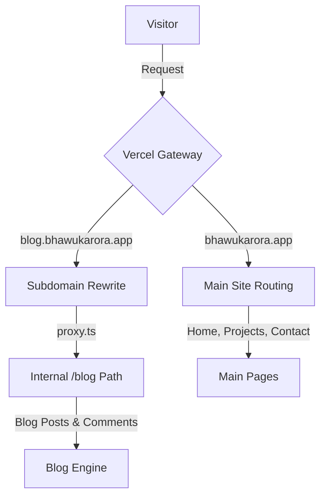
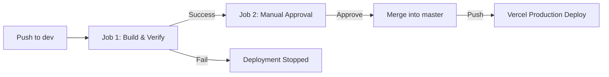

# Bhawuk Arora | Personal Site & Blog 🚀

[](https://nextjs.org)
[](https://tailwindcss.com)
[](https://clerk.com)
[](https://supabase.com)
[](https://github.com/features/actions)
[](https://vercel.com)

Welcome to the source code repository of my personal home base and blog engine. Built on a modern tech stack utilizing Next.js 16, Clerk Authentication, and a custom edge subdomain proxy.

---

## 🛠️ Tech Stack & Architecture

- **Framework**: Next.js 16 (App Router, React 19, Turbopack)
- **Styling**: Tailwind CSS v4
- **Authentication**: Clerk (Unified session management across main domain & subdomains)
- **Backend & Database**: Supabase (Database management, real-time blog comments, upvotes/ratings)
- **Deployment**: Vercel

### Subdomain Routing

This codebase handles both the main portfolio site and the blog on a single repository and single Vercel deployment. Incoming traffic is resolved at the Edge by `proxy.ts`:



---

## ⚡ Key Features

- 📝 **MDX Powered Blog**: Fully-fledged blog posts rendering seamlessly using markdown.
- 💬 **Secure Comments & Rating System**: Real-time engagement backed by Clerk authentication and Supabase database actions.
- ⚡ **Ultra-Minimal Loader**: Lightweight, beautiful three-dot bouncing loader design for streamlined transitions.
- 📧 **Direct Contact System**: A clean, distraction-free contact panel powered by EmailJS.
- 🧑‍💻 **CI/CD Git Flow**: Automated build validation and manual-approval release gating.

---

## 🔄 CI/CD Pipeline

The project utilizes a Git-flow pipeline inside GitHub Actions. Developers work in the `dev` branch. Pushes to `dev` trigger compile validation and manual promotion to `master`:



---

## 🚀 Local Development

### 1. Clone the repository
```bash
git clone https://github.com/bhawuk-arora/BhawukArora-Prod.git
cd BhawukArora-Prod
```

### 2. Install dependencies
```bash
npm install
```

### 3. Setup environment variables
Create a `.env.local` file in the root of the project:
```env
# Clerk Keys
NEXT_PUBLIC_CLERK_PUBLISHABLE_KEY=your-clerk-publishable-key
CLERK_SECRET_KEY=your-clerk-secret-key

# Supabase Keys
NEXT_PUBLIC_SUPABASE_URL=your-supabase-url
NEXT_PUBLIC_SUPABASE_ANON_KEY=your-supabase-anon-key
```

### 4. Start the dev server
```bash
npm run dev
```

Open [http://localhost:3000](http://localhost:3000) (or [http://blog.localhost:3000](http://blog.localhost:3000) to test the subdomain layout) to view your local instance.

---

## 📬 Contact
- **Email**: [contact@bhawukarora.app](mailto:contact@bhawukarora.app)
- **GitHub**: [@bhawuk-arora](https://github.com/bhawuk-arora)
- **LinkedIn**: [Bhawuk Arora](https://linkedin.com/in/bhawuk-arora)
